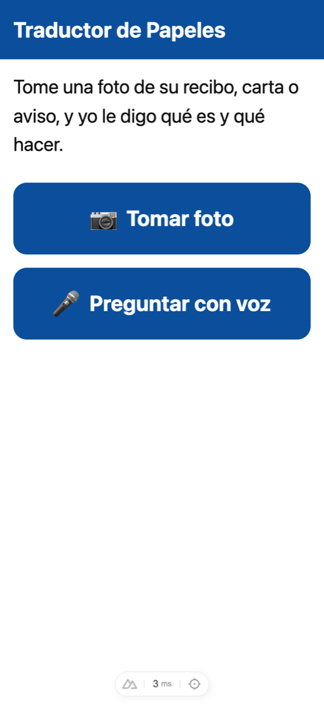
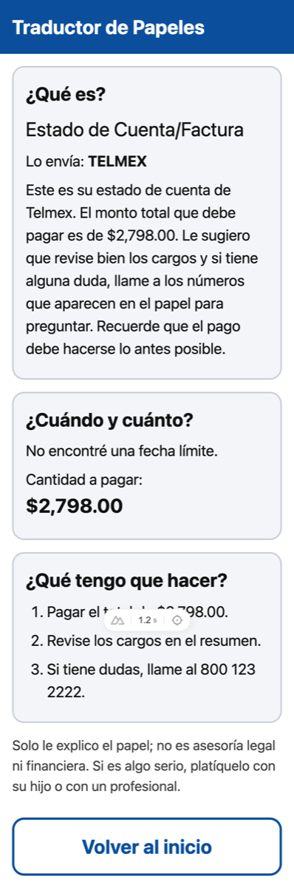
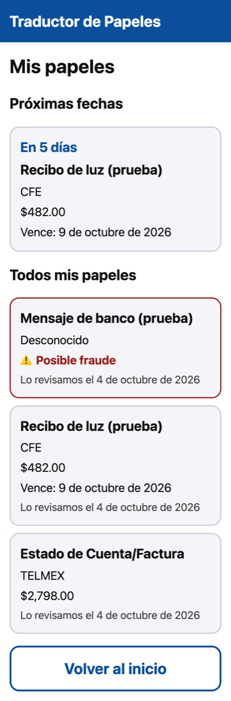
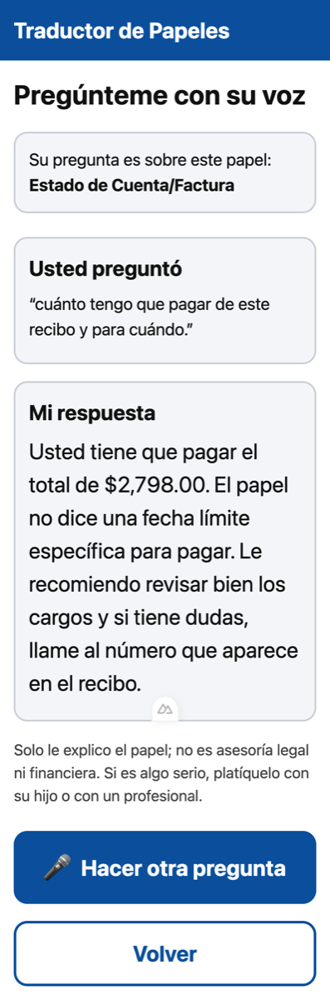
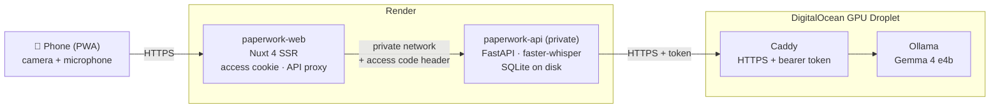

# Paperwork Translator · *Traductor de Papeles*

> **Live demo: Sun Oct 4 – Wed Oct 7, 2026 only.** Gemma 4 runs on a rented GPU, so the demo is
> up for 3 days to keep costs bounded. After that, everything here still runs on your own
> machine (see [Run it locally](#run-it-locally)).

My mom gets a lot of paperwork: electricity bills from CFE, letters from the bank, notices
from the SAT (the tax authority), and now and then something scary-looking like a court
summons. Every one of them is written in a dense bureaucratic Spanish, and every one of them
ends up as a phone call to me: *"Mijo, ¿qué es esto? ¿Tengo que pagar algo?"*

**Paperwork Translator** is a mobile web app built for her. She takes a photo of the document
(or asks a question out loud) and gets an answer in plain, warm Mexican Spanish (or in English,
for family and friends who'd rather read it that way; there's a language switch in the header):

1. **What it is** and who sent it.
2. **When and how much**: the deadline and the amount, only if they're actually printed.
3. **What to do**, in a few short steps.
4. **A clear fraud warning** if it asks for personal data, pushes false urgency, or looks off.

If there's a deadline, one tap on **"Agregar a mi calendario"** downloads a calendar reminder
that goes off 3 days and 1 day before. **"Mis papeles"** lists past documents and upcoming
due dates.

Built for the [DEV Hacktoberfest Weekend Challenge 2026: Build for a Friend](https://dev.to/events/challenges/hacktoberfest-weekend-2026-10-01).
**Open-source AI is the core:** at runtime the app uses only open models (Gemma 4 and Whisper)
and no closed-model APIs.

| Home | Result | History | Voice |
|---|---|---|---|
|  |  |  |  |

## Who it's for

An older, non-technical user on a phone. That drives every design choice:

- Two big buttons on the home screen, **"Tomar foto"** and **"Preguntar con voz"**, and one
  primary action per screen.
- 20 px base text, 72 px buttons, high contrast, and loading and error messages always visible
  in plain language ("Estoy leyendo su papel… puede tardar hasta un minuto").
- Spanish by default, English one tap away: **Español** / **English** buttons in the header,
  remembered on the phone. The choice also sets the language of the explanations, of the
  spoken question and of the calendar reminder.
- No accounts or passwords to remember: a single family access code, entered once.
- Installable to the home screen as a PWA.
- The AI **explains only**. It never gives legal or financial advice, never makes up an
  amount or a date, never asks for passwords, PINs, card or ID numbers, and for serious
  matters says to talk with her son or a professional. If the photo is unreadable, it says so
  and asks for another one.

## Architecture



| Path | What it is |
|---|---|
| `api/` | FastAPI (Python 3.12, uv, Pydantic, SQLModel/SQLite, pytest, ruff, mypy). `POST /documents/analyze`, `GET /documents`, `GET /documents/{id}`, `GET /documents/{id}/reminder.ics`, `POST /questions/voice` (the three that produce text take `?lang=es|en`, default `es`). Versioned prompts in `api/prompts/`. |
| `web/` | Nuxt 4 (TypeScript strict), mobile-first PWA, UI in Spanish and English (`@nuxtjs/i18n`, strings in `web/i18n/locales/`). Server routes proxy to the API so the API URL and access code never reach the browser. |
| `samples/` | Anonymized test documents and a synthetic voice question. The only documents used in tests and demos. |
| `deploy/` | GPU droplet setup script and deployment guide. |
| `docs/DECISIONS.md` | Every technical decision and why it was made, including the model measurements. |

**How a photo becomes an answer:** the browser shrinks the photo to 1600 px → the Nuxt server
forwards it with the access code → the API checks type, size and file signature → Gemma 4
fills a strict JSON schema (`format` in Ollama's chat API, thinking off) → Pydantic validates
it, retrying once and otherwise returning an honest "No pude leer bien su papel" → only the
structured fields are saved.

**Voice:** Ollama doesn't document audio input for Gemma 4 yet, so the API transcribes speech
in memory with faster-whisper (`small`, told to expect the language she picked), then Gemma 4 answers using only the stored
fields of the document she's asking about.

### Privacy

- Photos and recordings are processed **in memory and discarded**, never written to disk.
- Only the extracted structured data (type, issuer, deadline, amount, steps, fraud flag,
  explanation) is stored.
- Logs never contain document contents, transcripts or personal data, only error types.
- Secrets live in `.env` (local) or Render's environment, never in the repo.
- The service worker caches static assets only, never documents or API responses.

## Why open source matters here

- **Privacy.** These are a family's bills, bank letters and tax notices. With open weights,
  documents go to a model *we* run, on hardware *we* rent or own, instead of being sent to a
  third party's API to be logged or kept under someone else's retention policy.
- **Zero cost per request.** No per-token or per-image fees. My mom can photograph every
  piece of mail without me worrying about a bill. The only cost is the hardware, and on my own
  laptop that's $0.
- **Control over the model.** We pin the exact model (`gemma4:e4b`), so its behavior doesn't
  change under us. We could test it before trusting it (the [spike results](docs/DECISIONS.md)
  caught it mistaking an issue date for a deadline, which a prompt rule fixed), and we can turn
  off "thinking" to make it 2× faster. No vendor can deprecate it or change the price.
- **It runs anywhere.** The same code runs on a MacBook, a Linux GPU box, or (slowly) a plain
  CPU server, with an Apache 2.0 model (Gemma 4) and an MIT one (Whisper).

## Run it locally

Requirements: [uv](https://docs.astral.sh/uv/), Node 24, and [Ollama](https://ollama.com).
On a Mac, run Ollama natively (Docker on macOS can't use the GPU).

```bash
cp .env.example .env                 # set ACCESS_CODE and NUXT_ACCESS_CODE to the same value
ollama pull gemma4:e4b               # ~6.6 GB

cd api && uv sync && uv run fastapi dev app/main.py     # http://localhost:8000/docs
cd web && npm install && npm run dev -- --dotenv ../.env # http://localhost:3000
```

Open http://localhost:3000 and enter the access code. (Browsers only allow the microphone on
HTTPS or `localhost`, so to try voice from a phone, use the deployed demo or an HTTPS tunnel.)
The first voice question downloads the Whisper weights (~460 MB) into `api/.models/`.

Everything in Docker (Linux with a GPU, or CPU-only and slow): `docker compose up`, then
`docker compose exec ollama ollama pull gemma4:e4b`.

### Checks

```bash
cd api && uv run ruff check . && uv run mypy . && uv run pytest   # unit tests mock the model
cd api && uv run pytest -m integration                           # real Gemma 4 + Whisper on /samples
cd web && npm run lint && npm run typecheck && npm test
```

CI runs lint, typecheck and unit tests for each folder on every PR and on pushes to
`develop` and `master`.

### Deploy

See [`deploy/README.md`](deploy/README.md): a DigitalOcean GPU Droplet running Ollama behind
Caddy (HTTPS + bearer token), plus a Render Blueprint (`render.yaml`) for the web app and a
private API service.

## Branching model

GitFlow with **non-stacked PRs**:

- `master`: production. Changes arrive only through `release/*` or `hotfix/*` PRs.
- `develop`: integration. Changes arrive only through `feature/*` PRs.
- `feature/<name>`: one per build step, always created from the latest `develop`, merged
  through a single PR into `develop`, then deleted. Never branched from another feature
  branch.
- `release/<version>`: from `develop`, PR into `master`, tagged, then `master` is merged back
  into `develop`.
- `hotfix/<name>`: from `master`, PR into `master`, then merged back into `develop`.

Commits and PR titles follow [Conventional Commits](https://www.conventionalcommits.org). The
whole build history is visible as PRs #1–#11.

## Challenge deadline

Submissions closed **Mon Oct 5, 2026, 00:59 Mexico City time** (= 06:59 UTC = Sun Oct 4,
23:59 PDT). Commits made after the deadline are listed here.

### Commits after the deadline

*None yet.*

## Built with AI assistance

I built this with Claude Code as a pair programmer: scaffolding, tests and the GitFlow PRs.
That was during development only. **The product itself uses no closed-model APIs**: at runtime
everything is Gemma 4 (via Ollama) and Whisper (via faster-whisper), both open-weight.

## License

Dual-licensed under MIT or Beerware, at your option. See [LICENSE.md](LICENSE.md).
Contributions are welcome under the [Code of Conduct](CODE_OF_CONDUCT.md).
